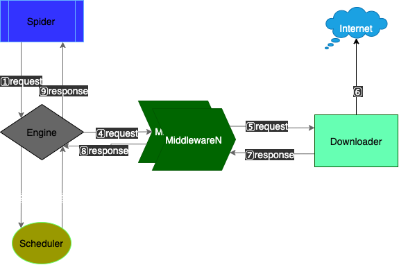

# mini_spider

## 程序设计

1. spider 产生请求发送给 engine
2. engine 把请求发给 scheduler 调度
3. engine 从 scheduler 取到待执行的请求
4. engine 把请求发给 middleware 进行包装
5. middleware 把请求发给 downloader 下载
6. downloader 下载
7. middleware 对 response 进行处理
8. middleware 把 response 发送给 engine
9. engine 把返回给 spider,回到开头

## TODO

- Context 序列化, 支持远程任务
- 优化 Spider 接口
- 增加扩展功能
- 添加更多常用中间件

## 要求和注意事项

1. 需要支持命令行参数处理。具体包含: -h(帮助)、-v(版本)、-c(配置文件路径）、-l（日志文件路径，2 个日志：mini_spider.log 和 mini_spider.wf.log)

- 通过 flag 实现参数的解析,代码见 [main.go](main.go)

2. 抓取网页的顺序没有限制
3. 单个网页抓取或解析失败，不能导致整个程序退出。需要在日志中记录下错误原因并继续。

- 通过添加[recover 中间件](core/middlewares/recover.go) 实现对业务 panic 的捕获

4. 当程序完成所有抓取任务后，必须优雅退出

- 通过 sync.WaitGroup 等待异步任务执行完成后优雅退出,代码见[core/engine.go/Run](core/engine.go)
- 监听 os.Signal 信号,在触发时安全退出程序,代码见[core/engine.go/Shutdown](core/engine.go)

5. 从 HTML 提取链接时需要处理相对路径和绝对路径

- 通过 [spider/simple.go/URLJoin](spider/simple.go) 函数处理相对路径和绝对路径,底层调用`(\*net.URL).ResolveReference` 函数实现

6. 需要能够处理不同字符编码的网页(例如 utf-8 或 gbk)

- 通过添加 [decoder 中间件](core/middlewares/decoder.go) 实现对不同网页编码转为 utf8 编码，底层调用 golang.org/x/net/html/charset 实现

7. 网页存储时每个网页单独存为一个文件，以 URL 为文件名。注意对 URL 中的特殊字符，需要做转义

- 通过添加 [saver 中间件](cmiddlewares/saver/middleware.go) 实现对符合要求的网页进行保存,文件名用 `url.QueryEscape`转 url 得到

8. 要求支持多 routine 并行抓取（注意：这里并不是指简单设置 GOMAXPROCS>1)

- [core/engine.go](core/engine.go) 并行通过 channel 实现，在开始任务之前写入 channel,在任务结束后从 channel 读出

9. 代码严格遵守百度 Golang 编码规范 V1.1（http://wiki.baidu.com/pages/viewpage.action?pageId=104882818）

- 代码严格遵守百度 Golang 规范，用 `golangci-lint` 保证代码不出现低级错误

10. 不仅仅考察编程规范，同时也考察编程思路：代码的可读性和可维护性要好，合理进行 pakcage、函数的设计和划分，多线程间的同步、信号量的使用等

- 代码拆分为框架层和业务层，框架层在 `core` 文件夹下,业务层包括 `spider` 和 `main` 等包

11. 完成相应的单元测试和使用 demo。你的 demo 必须可运行，单元测试有效而且通过

- 从 pipeline 可以下载可执行文件，单测覆盖率 76.2%，有一些操作文件的代码不好写单测，尽可能把这部分代码单拆了

12. 注意控制抓取间隔（设计上可以针对单个 routine 控制，也可以针对站点进行控制），避免对方网站封禁百度 IP。可以使用 Ps Python CM 委员会为 Python good cooder 考试提供测试抓取网站: http://pycm.baidu.com:8081。

- 通过 `time.Timer` 实现了[library/limter/limter.go](library/limter/limter.go)间隔控制 limter,用[core/middlewares/downlimiter.go](core/middlewares/downlimiter.go)中间件调用 limter 实现流程控制。

13. 日志库请使用http://icode.baidu.com/repos/baidu/go-lib/log
14. 主配置文件读取使用https://github.com/go-gcfg/gcfg
15. html 解析请使用 https://go.googlesource.com/net/
16. 编译环境配置请参考：http://wiki.baidu.com/pages/viewpage.action?pageId=515622823
17. 对于配置文件的异常，需要进行检查和处理

- 用`github.com/go-playground/validator/v10`对文件配置进行校验
